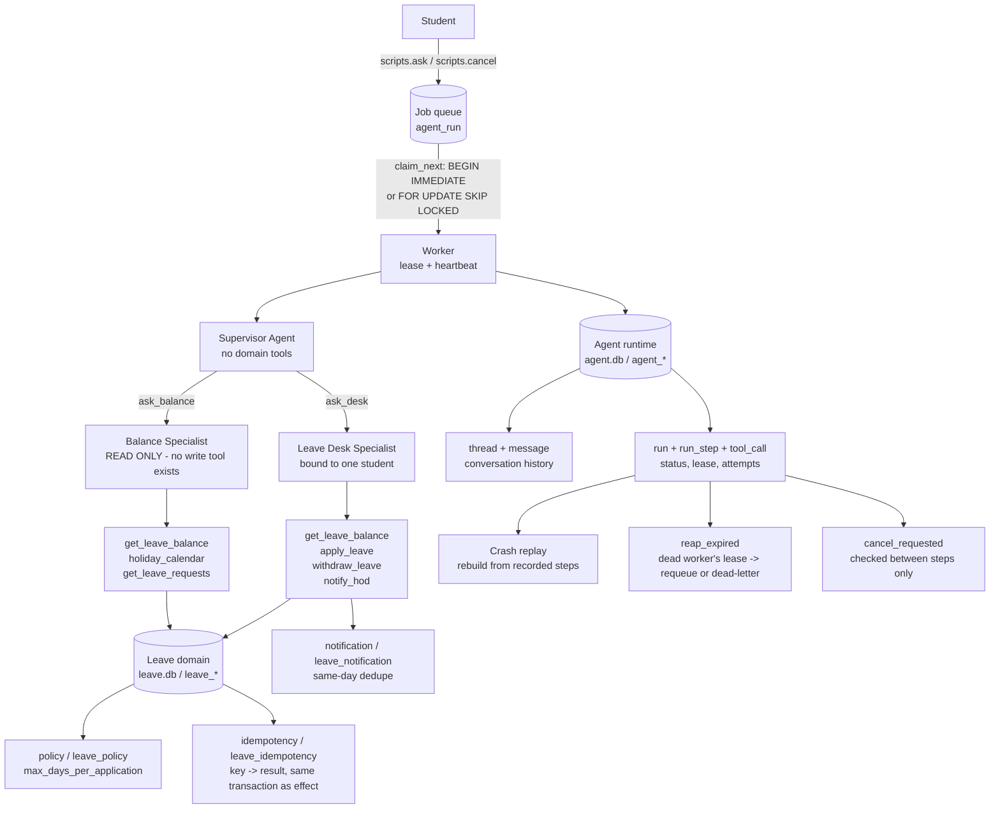

# System architecture

Same design locally and in the cloud: two logical stores (leave domain, agent
runtime), a durable queue between the student and the model, and two
specialists with different privileges behind one supervisor. Only the
implementation of the two stores changes — SQLite files locally, PostgreSQL
tables + RPC functions in one Supabase project.

Source: [`architecture.mmd`](architecture.mmd) (Mermaid) and
[`architecture.dot`](architecture.dot) (Graphviz, rendered to
[`architecture.png`](architecture.png) with `dot -Tpng architecture.dot -o
architecture.png`).

## Reading the diagram

**Request path.** A student's message becomes a row in the queue
(`scripts.ask`), not a direct function call. A worker claims it — atomically,
so two workers can never claim the same run — leases it, and only then hands it
to the supervisor. The supervisor has exactly two tools, `ask_balance` and
`ask_desk`; it cannot touch leave data itself even if a model tried to invent a
shortcut.

**Least privilege.** The balance specialist's toolset contains no write tool at
all — not "a write tool that refuses," an *absent* one. The desk specialist is
constructed with one student's roll number baked in and no tool that accepts a
different one, so it structurally cannot act for anyone else.

**The rule that can't be skipped.** `max_days_per_application` is a row, and
`apply_leave` checks it inside the same transaction as the write. Change the
number in the table and the very next call respects it — nothing in a prompt
has to change.

**Durability.** Every model step and tool call is recorded before the next one
starts. If a worker dies, `reap_expired` notices the stale lease and requeues
the run (or dead-letters it, past `max_attempts`); whichever worker picks it up
next rebuilds exactly where the model left off from those recorded steps
(`app/runner.py:rebuild`), and every write it's about to repeat is guarded by
an idempotency key stored next to that write's result.

**Cancellation.** A cancel request only sets a flag. The worker checks that
flag *between* steps — never inside a tool call — so a leave application is
never left half-applied because a student changed their mind mid-run.
